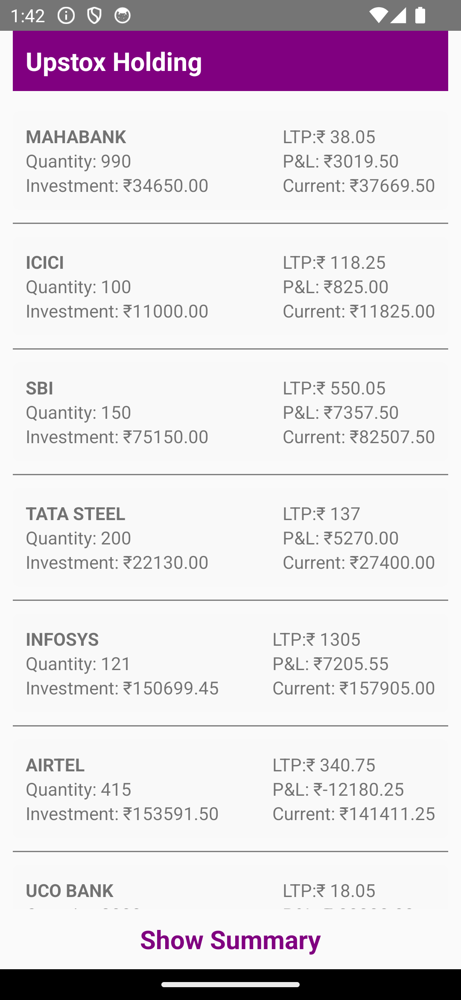
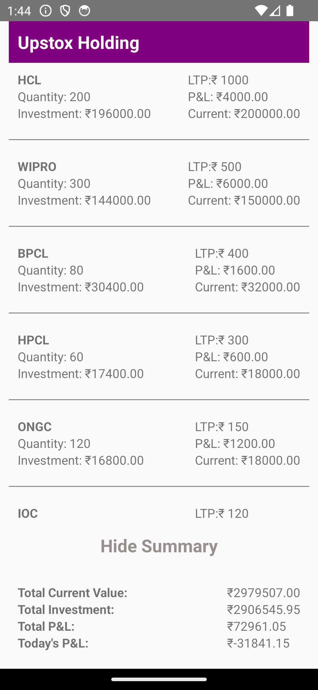

# HoldingsList App

## Overview

The HoldingsList app is a React Native application that fetches and displays a list of holdings. It includes features to show individual holding details and a summary of the total values.

## Features

- Fetches holding data from an API.
- Displays a list of holdings with details such as quantity, investment value, current value, and P&L.
- Includes a summary view that shows total current value, total investment, total P&L, and today's P&L.
- Error handling and loading states.

## Setup

To get started with this project, follow these steps:

### Prerequisites

- Node.js (version 14 or later)
- React Native CLI
- Expo CLI (optional, if using Expo)

### Installation

1. **Clone the repository:**

   ```bash
   git clone https://github.com/AbhavThakur/MyHoldings
   cd MyHoldings
   npm install
   ```

2. **Run the app:**

   ```bash
   npx react-native run-android
   ```

3. **Screenshots:**

   
   
